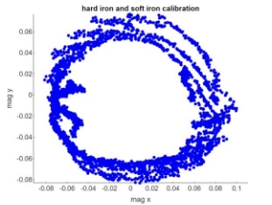
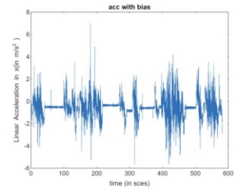
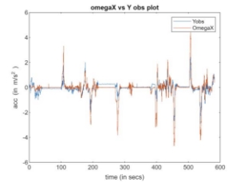
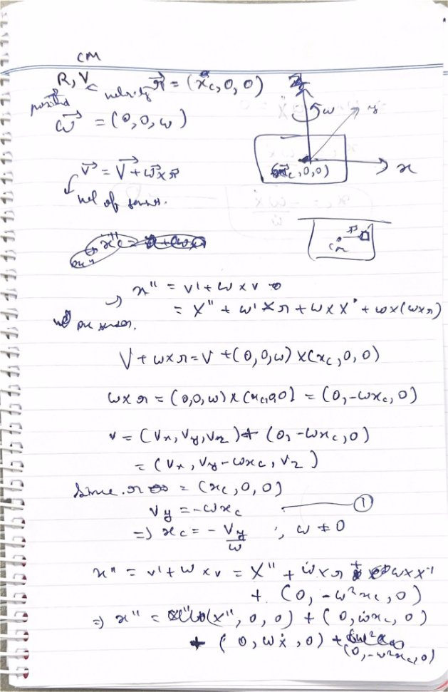
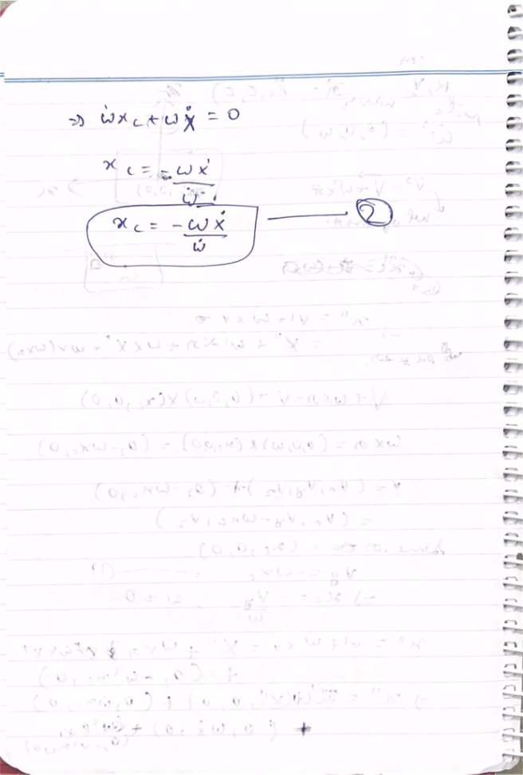

LAB 4 

**Magnetometer Calibration: **

 

The initial magnetic field plot looked like an ellipse since hard iron moved its origin and soft iron distortion rotated it and changed it into an ellipse. To fix this, I fit an ellipse on the plot and then got the parameters of the fitted ellipse.  

For hard iron distortion, I shifted the origin by removing the offset on the x axis and y axis from all the magnetometer values. 

For soft iron distortion, I transformed the fitted ellipse into a circle by multiplying all the values with a transformation matrix. 

Sources of distortion: 

- Hard iron distortions: They are created by objects that produce a magnetic field. A speaker or piece of magnetized iron for example will cause a hard iron distortion. If the piece of magnetic material is physically attached to the same reference frame as the sensor, then this type of hard iron distortion will cause a permanent bias in the sensor output. 
- Soft iron distortions: They are considered deflections or alterations in the existing magnetic field. These distortions will stretch or distort the magnetic field depending upon which direction the field acts relative to the sensor. This type of distortion is commonly caused by metals such as nickel and iron.  

**Computing Yaw: **

The yaw calculated from the gyroscope data is relatively smoother and less sensitive (fewer peaks) as compared to the IMU yaw, while the yaw derived from the magnetometer data is relatively less smooth. ****

The complementary filter can be thought of as a union of two different filters: a high-pass filter for the gyroscope and a low-pass filter for the accelerometer. The high pass filter only passes the values above a certain limit, unlike the low-pass filter. The formula resulting from combining the two filters is: 

angle = (1 - α) \* (angle + gyroscope \* dt) + α \* accelerometer The cutoff frequency that I used was 40 Hertz. 

I would trust the gyroscope yaw for navigation because it’s similar to the IMU yaw and has less deviations as compared to the magnetometer yaw. 

**Estimating Forward Velocity: **

 

Since the accelerometer has a bias to it, I averaged the bias out over intervals before the car came to a stop or had constant velocity. This helped me eliminate the bias from the accelerometer. I had a negative bias and all the values at rest went back to zero.   

Since we are integrating the acceleration for the IMU velocity, the bias and random noise gets integrated too. This enhances the error and it leads to a deviation from the actual data. 

GPS is more true to the actual data.    

**Dead reckoning:** 

Y observed seems to be noisy because of integration so I applied a low pass filter on it. 

After filtering it, Xomega and Yobs seem pretty similar. 

The differences are because we got Yobs after integrating it, hence increasing the noise/errors. 

The scaling factor used here was 1.5. 

The GPS and IMU positions were within 2m only during the start but they drifted off eventually. 

The dead reckoning didn’t exactly match the measurements. One critical drawback of the IMU is its additive noise. When we integrate the accelerometer measurements to estimate the vehicle position, we are taking the noise as well, resulting in a very large accumulated error. So, the vehicle position solution has a big drift. 

